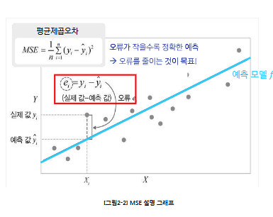
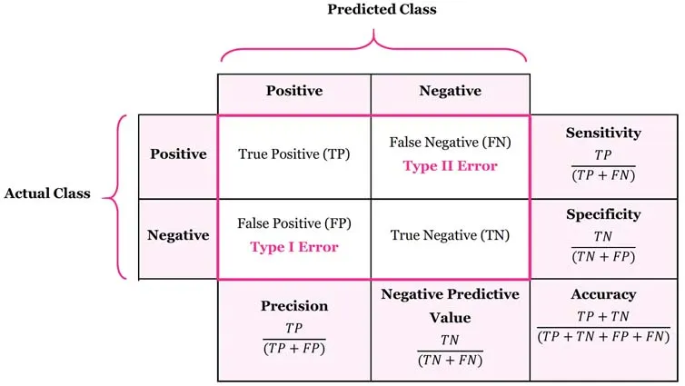

## 1. 지도학습 개념
`지도학습(Supervised learing)` : 정답 라벨이 있는 훈련 데이터를 사용해 예측 모델 학습 
**목표** : 새로운 데이터에서도 정확한 예측을 위해  
- `회귀` : 예측하고 싶은 결과값이 **숫자**일 때 
ex) 가격, 점수, 온도 
- `분류` : 예측하고 싶은 결과값이 **범주**일 때 
ex) 스팸/정상, 질병 유/무 
 

## 2. 회귀(Regression)
특징 : 라벨 및 예측 모델의 출력은 **연속적인 수치** 
모델의 정확도를 **평균제곱오차** or **결정계수** 이용 

- **평균제곱오차** 
`평균제곱오차(Mean Squared Error)` : 각 데이터 정답과 예측의 평균 제곱 차이의 값
 
MSE가 제곱이라 해석 어렵다면? 
**RMSE(MSE의 제곱근)**도 사용 
- **결정계수(R^2)** 
`결정계수` : Label의 분산 중에 Feature로 설명되는 비율 
특징 : **1에 가까울수록 설명력이 높고, 낮을수록 설명력이 낮음** 
-> 만약 예측값이 평균값보다 못하면 음수 나오기도 함 

**결정계수와 평균제곱오차는 필요에 따라 상호보완적으로 함께 사용** 
 

## 3. 분류(Classification)
특징 : **범주 라벨(이진/다중)** 
모델의 정확도를 **분류 정확도** or **혼동행렬** 이용 
- **정확도** 
전체 예측 중에서 올바르게 맞춘 예측의 비율 
`Accuracy = 올바르게 맞춘 개수 / 전체 예측 개수` 
-> 정확도는 단순히 "전체 맞춘 비율"이므로 다른 지표와 함께 봐야 안전 
- **혼동행렬** 

정밀도 : "양성이라 판정한 것 중" 진짜 양성의 비율(TP /TP + FP) 
재현율 : "진짜 양성 가운데" 잡아낸 예측 양성 비율(TP / TP + FN) 
F1-score : 정밀도와 재현율의 조화평균(2* 정밀도 * 재현율 /(정밀도 + 재현율)) 

 

## 4. 학습의 목적
목적 : 새로운 데이터에서도 정확한 예측을 수행 
- `오버피팅(overfitting)` : 훈련 데이터의 **우연한 패턴/잡음**까지 외워버려 훈련에서는 잘 맞지만 테스트의 성능은 나빠짐 
-> 훈련 오류 급격히 낮음, 테스트 오류 높음/요동 
- `언더피팅`: **모델이 단순**하거나 완료되지 않음 
-> **중요한 패턴을 놓쳐서** 오류가 커짐 

**해결방법 : 더 많은 데이터, 테스트 데이터를 활용한 모델 선정, 교차검증(3차시)** 

