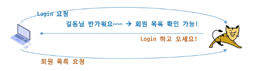

## Cookie & Session

### 등장 배경



**Stateless : 상태를 기억하지 않음**

- **단순성** : 각 요청이 **독립적으로 처리**되기에, 이전 요청과 연결할 필요가 없고 서버의 **구성이 단순해지며 속도가 빨라짐**
- **확장성** : **여러 서버 간 공유해야 할 상태가 없어,** 여러 서버 요청을 분산시킬 수 있어 부하 **분산 및 시스템 확장 용이**
- **신뢰성** : **요청들이 독립적**이라 요청의 실패가 다른 요청에 영향을 미치지 않아 **시스템 신뢰도 향상**
- **자원절약** : **서버에서 상태를 저장하지 않아** 그만큼 서버의 메모리. **저장 공간 절약**
  
<br><br>

## Cookie

**웹 서버에서 정보를 생성해서 클라인트(웹 브라우저)에 보관하는 데이터**

```jsx
[사용자 브라우저]                         [서버]
       |                                   |
1. 요청  --------------------------------> |
       |                                   |
       |                          2. 응답하면서
       |                             "쿠키 저장해" 전달
       | <-------------------------------- |
       |      Set-Cookie: userId=ssafy     |
       |                                   |
3. 브라우저가 쿠키 저장                     |
       |                                   |
4. 다음 요청 보낼 때 자동으로               |
   쿠키를 같이 보냄 ----------------------> |
       |         Cookie: userId=ssafy      |
       |                                   |
5. 서버가 쿠키 꺼내서 사용                  |
       |                                   |
```

---

### Cookie의 주요 property

- name을 제외한 property는 getter/setter로 접근
- name : 쿠키를 만들때 전달하는 쿠키의 이름으로 각각의 쿠키를 구별하는 유일한 값
    - 동일한 이름의 쿠키는 기존 쿠키를 덮어씀
- value : 쿠키의 값으로 쿠키 생성 시 전달하거나 setValue() 메서드를 통해 설정 가능
    - 작성 규칙은 name과 동일하며 추가로 한글 사용 가능
- path : 쿠키의 유효한 경로
    - path가 설정된 하위 경로 요청에 대해서만 쿠키 전송
    - 경로 미 설정 시: context root
    - / 즉 container root로 지정하면 동일 도메인의 다른 애플리케이션까지 접근
- maxAge : 쿠키의 유효 기간
    - 양수 : 초 단위로 해당 시간까지 쿠키 존재, 시간이 지나면 자동 패기
    - 음수 또는 미 지정 시 세션 쿠키로 브라우저 종료 등으로 세션 종료 시 폐기
    - 0 : 브라우저에 도착하는 즉시 폐기(쿠키는 서버에서 지울 수 없고, 0이 클라이언트에 도착하면 지워짐)
- 보안 옵션
    - secure : HTTPS에서만 전송 허용 → 쿠키 가로 채기 방지
    - httpOnly : 서버만 접근 가능하며 JavaScript에서 접근 불가 설정 → XSS  공격 방지
    - SameSite : 쿠키 전송 가능 사이트 제한 → CSRF 공격 방지
  
<br><br>

## Session

- 서버에 클라이언트의 상태 값을 저장
- 하나의 브라우저 당 하나의 세션 성립
- 쿠키는 브라우저를 닫아도 유지될 수 있으나 세션은 브라우저를 닫으면 종료
- 세션을 동작하기 위해서는 JESSIONID라는 이름의 쿠키 필요
    - JESSIONID는 서버의 세션 공간에 들어가기 위한 키

```jsx
[브라우저]                                      [서버]
    |                                              |
1. 로그인 요청  ---------------------------------> |
    |                                              |
    |                                  2. 로그인 성공
    |                                  3. 세션 생성
    |                                  4. 사용자 정보 저장
    |                                     session.setAttribute(...)
    |                                              |
    | <-------------------------------------------- |
    |      JSESSIONID 라는 쿠키 전달                 |
    |                                              |
5. 브라우저가 JSESSIONID 저장                        |
    |                                              |
6. 다음 요청 때 JSESSIONID 자동 전송 -------------> |
    |                                              |
    |                                  7. 서버가 세션 찾기
    |                                     session.getAttribute(...)
    |                                              |
```

---

### HttpSession 사용

- Servlet에서 Session 객체 사용
    - request.getSession(): 현재의 세션을 반환하며 아직 없을 경우 새로 생성

```jsx
getSession()              → 세션 얻기
setAttribute(key, value)  → 값 저장
getAttribute(key)         → 값 조회
removeAttribute(key)      → 일부 삭제
invalidate()              → 전체 삭제 (로그아웃)
setMaxInactiveInterval()  → 유효시간 설정
getLastAccessedTime()     → 세션 마지막 접근 시작
```