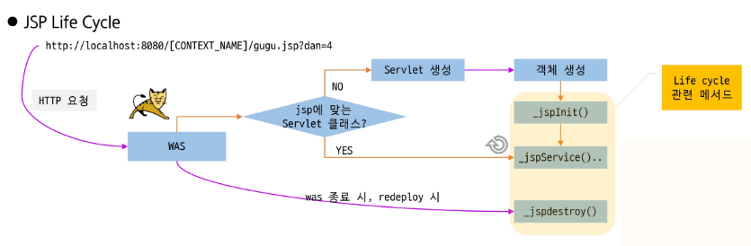
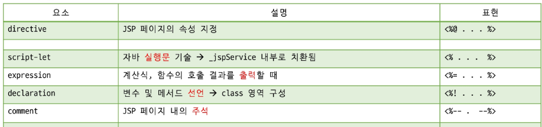

## JSP

### 등장 배경

- Servlet은 자바 코드 안에 HTML 작성한다
    - HTML을 수정하려면 자바 개발자가 수정해야 했음
    - 디자이너가 작업하기 어려움

**→ “HTML 중심으로 쓰고, 필요한 곳에만 Java를 넣자”**

**Servlet : Java 안에 HTML**

**JSP : HTML 안에 Java**

---

### JSP의 동작 원리


**.jsp파일을 요청하면?**

1. **변환** : WAS container가 JSP파일을 읽어 자바 소스 파일(`.java`)로 변환
2. **컴파일** : 변환된 `.java` 소스 파일을 컴파일 하여 서블릿 클래스 파일(`.class`)을 생성
3. **로딩 및 초기화** : 서블릿 클래스를 메모리에 로드 뒤 인스턴스 생성하고, `init()` 메서드를 실행
4. **실행** : 사용자의 요청이 있을 때마다 `_jspService()` 메서드가 실행되어 동적으로 HTML을 생성하고 브라우저에 전달



---

### 로컬 저장소

- **경로** : `{Tomcat_설치경로}/work/Catalina/localhost/{프로젝트명}/org/apache/jsp/`
- 생성된 자바 파일에서 확인할 내용들
    - Servlet Life Cycle에 해당하는 메서드
    - service 메서드의 local 변수들

## JSP 구성요소



---

#### **directive (지시자)**

- **JSP 전체 설정**

```jsx
<%@ [directive]속성="값" 속성="값" %>
```

**특징**

- JSP 페이지 전체 설정 정보
- 필요한 정보를 컨테이너에게 알려서 서블릿 생성에 활용

**종류**

- `page`  : JSP 페이지에 대한 **기본 정보 지정**(모든 JSP 필수 요소)
- `taglib`  : JSP 페이지에서 사용할 **태그 라이브러리 지정**(JSTL)
- `include` : JSP페이지에 특정 영역에 **다른 문서 포함**(page 모듈화 및 재사용)

---

#### **script-let**

- **Java 코드 작성**

```jsx
<% [자바 실행문] %>
```

**특징**

- `_jspServlet` 메서드 내부에 삽입됨 → **local**
- local영역에 선언된 **JSP 내장 객체(HttpServletRequest, HttpServletResponse,..)등을 자유롭게 사용**

---

#### **declaration**

- 변수, 메서드 선언

```jsx
<%! [멤버 변수 또는 메서드 ]%>

```

**특징**

- **선언 위치에 상관 없이 멤버 변수, 메서드 선언**

---

#### **expression**

- **값 출력**

```jsx
<%= [출력할 내용] %>
```

**특징**

- **<%=변수%>, <%=리턴이 있는 메서드 호출%>, <%=수식%>**
- Servlet에서 **_jspService() 내부에서 out.print() 형태**로 변형

---

### 코드로 보는 구성요소

```jsx
import ... //include는 밖에서

public class xxx_jsp extends HttpServlet {

    //declaration 영역 : 클래스 내부 영역(전역)
    // (<%! %>)
    int count = 0;

    public int add(int a, int b){
        return a + b;
    }

    public void _jspInit() {
        // init()
    }

    public void _jspDestroy() {
        // destroy()
    }

    public void _jspService(HttpServletRequest request, HttpServletResponse response) {

        // scriptlet 영역 : 메서드 내부 (지역)
        // (<% %>)
        int num = 10;

        // expression 영역
        // (<%= %>)
        out.print(num);
    }
}
```