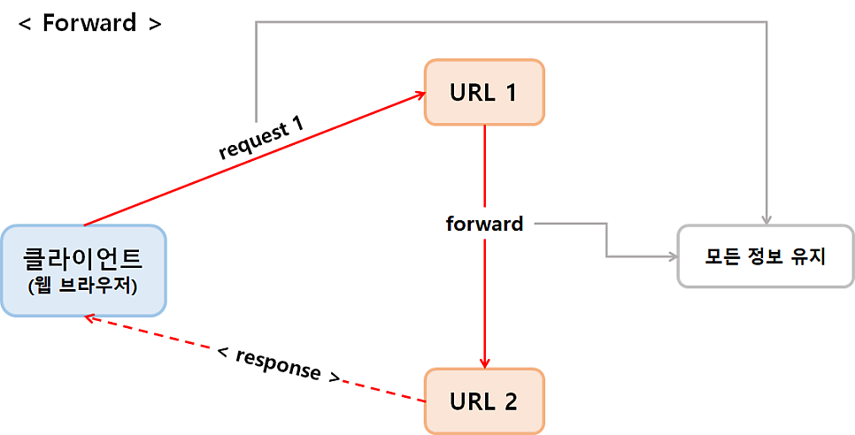
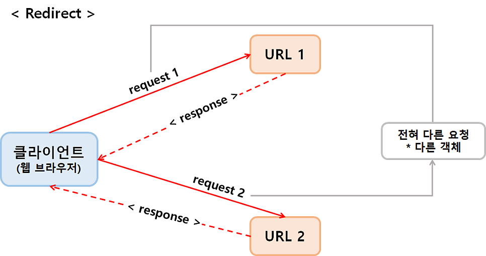

## forward vs direct

### forward

- **서버 내부에서 요청을 넘기는 것**

#### 흐름

1. 클라이언트 → A요청
2. Servlet A가 처리하닥
3. 다른 JSP/Servlet B로 넘긴
4. B가 응답 생성 → 클라이언트에게 전달

#### 특징

- **URL 안바뀜**
- request 객체 그대로 유지
- 속도 빠름(서버 내부 이동)

```jsx
RequestDispatcher disp = request.getRequestDispatcher("result.jsp");
disp.forward(request, response);
```

#### 사용 상황

- 데이터를 넘겨서 화면 보여줄 때
- **MVC에서 Controller → JSP**



---

### Redirect

- **클라이언트에게 “다시 요청해라” 시키는 것**

#### 흐름

1. 클라이언트 → A요청
2. 서버가 응답 → “B로 다시 가”
3. 클라이언트가 B로 새 요청
4. B가 응답

#### 특징

- **URL 바뀜**
- request 유지 되지 않음, **새로 생성**
- 속도 느림(한 번 더 요청)

```jsx
response.sendRedirect("result.jsp")
```

#### 사용 상황

- 새로고침 문제 해결
- **POST → GET 패턴(PRG) 패턴**



---

### Forward vs Redirect
| 구분 | Forward | Redirect |
| --- | --- | --- |
| 요청 횟수 | 1번 | 2번 |
| URL 변경 | 그대로 | 변경 |
| request 유지 |  유지 | 새로 생성 |
| 위치 | 서버 내부 | 클라이언트 |
| 속도 | 빠름 | 느림 |