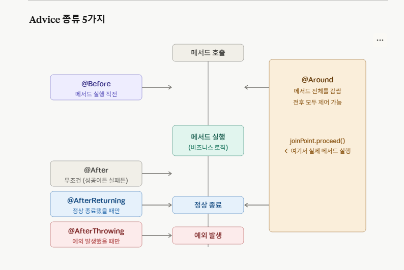

## AOP(Aspect-Oriented Programming)

- 애플리케이션 핵심 비즈니스 로직과 공통적으로 사용되는 부가 가능 분리하여 관리하는 프로그래밍
- 여러 곳에서 공통적으로 쓰이는 코드를 한곳에 모아 관리해 코드를 중복을 줄이고 유지 보수성 높이는 기술

---

### 핵심 용어

#### Aspect

- 공통 기능을 하나로 모아둔 클래스
- Aspect = Pointcut(어디에?) + Advice(뭘?)
- class 단위

→ service 패키지의 모든 메서드가 실행될 때(pointcut), 로그를 남겨라 (advice)

```jsx
// 여러 공통 기능은 Aspect를 따로 만들어, 기능별 분리
@Aspect  //"나는 공통 기능 모아둔 클래스"
@Component  //"Spring Bean으로 등록해줘(Spring이 알아야 )"
public class LoggingAspect {
    // 로그 관련만

    // Pointcut — 어디에?
    // Advice   — 뭘?
    @Before("execution(* com.example.service.*.*(..))")
    public void logBefore() {
        System.out.println("메서드 시작!");
    }
    
}

@Aspect @Component
public class AuthAspect {
    // 인증 관련만
}

@Aspect @Component
public class TransactionAspect {
    // 트랜잭션 관련만
}
```

- execution(반환타입 패키지 경로.클래스이름.메서드이름(파라미터))
    
    * : 뭐든 하나
    
    .. : 뭐든 여러개 패키지, 클래스, 메서드 순서로 범위를 지정
    
<br>

#### Advice

- “언제, 뭘 실행할지”, 진짜 실행 코드
- method 단위-



- `@Before`  : 메서드 실행 전
- `@After` : 성공이든 실패든 무조건 실행
- `@AfterReturning` : 정상 종료됐을 때만, 반환값도 받을 수 있음
- `@AfterThrowing` : 예외 터졌을 때
- `@Around`  : 전후 통째로 감쌈

<br>

#### JoinPoint

- 현재 실행 중인 메서드 정보를 담고 있는 객체

| 메서드                                  | 어디서    | 뭘 얻음              |
| --------------------------------------- | --------- | -------------------- |
| `getSignature().getName()`              | 어디서든  | 메서드 이름          |
| `getArgs()`                             | 어디서든  | 파라미터 값          |
| `getTarget()`                           | 어디서든  | 실제 객체            |
| `(MethodSignature).getParameterNames()` | 어디서든  | 파라미터 이름        |
| `(MethodSignature).getMethod()`         | 어디서든  | 어노테이션 접근      |
| `proceed()`                             | @Around만 | 실제 메서드 실행     |
| `proceed(newArgs)`                      | @Around만 | 파라미터 바꿔서 실행 |

<br>

#### Pointcut

- Advice를 어디에 적용할지 범위를 정함

**종류**

- `@execution` : 메서드 단위로 범위 지정
    - execution(반환타입 패키지 경로.클래스이름.메서드이름(파라미터))
        
        * : 뭐든 하나
        
        .. : 뭐든 여러개 패키지, 클래스, 메서드 순서로 범위를 지정
        
- `@within` : 패키지/클래스 단위로 범위 지정
- `@annotation` : 특정 어노테이션 붙은 메서드만
- `bean()` : 특정 bean이름으로 범위 지정
    - `@bean` 은 Spring컨테이너에 등록하고
    - `bean()` 은 `@Pointcut("bean(*Service)")` 으로 사용되며 어떤 bean에 advice를 적용할지
- `args`  : 파라미터 타입으로 범위 지정

<br>

#### Weaving

- Pointcut으로 지정한 곳에 Advice 끼워 넣는 과정
- 실제로 행동하는 것(동사라고 생각)