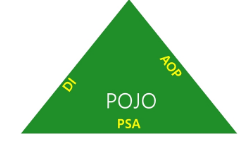

## Framework

- **틀(Frame)을 가지고 하는 작업 또는 틀 자체**

---

### 주요 특징

#### POJO(Plain Old Java Object)

- 자바 객체로 개발하자

**왜? → 전에는 EJB 무거운 기술 때문에**

- EJB(Enterprise JavaBean)
    - 무겁고 복잡 : 간단한 기능 만들려해도 인터페이스와 XML 파일 필요
    - EJB 컨테이너가 있어야 테스트 가능해 개발 속도 느림
    - 특정 인터페이스를 상속 받야아하는 유연성 떨어짐

**특징**

- 특정 기술에 종속되지 않음
- 클래스 + 필드 + 메서드
- 테스트 쉬움

---

### POJO 기반의 DI, AOP, PSA



#### DI (Dependency Injection) : 의존성 주입

- **객체가 필요한 의존성을 직접 만들지 않고, 외부에서 넣어주는 것**

**장점**

1. 결합도 낮아짐
2. 테스트 쉬워짐
3. 유지보수 쉬움

**스프링에서는 객체를 대신 만들어주고 넣어줌 → IOC 컨테이터**

---

#### AOP(Aspect Oriented Programming) : 관점 지향 프로그래밍

- **공통 기능을 핵심 로직에서 분리해서 따로 관리하는 것(외부에서)**

**구조**

1. 핵심 관심사(ex) 주문처리, 회원가입, 결제)
2. 공통 관심사(ex) 로그, 보안, 트랜잭션 )

**Advice**

- @Before : 실행 전
- @After: 실행 후
- @Around : 전후 모두

---

#### PSA(Portal Service Abstraction): 서비스를 추상화해서 자유롭게 바꿔 낄 수 있게 함

- **기술이 바뀌어도 같은 방식으로 사용할 수 있게 추상화한 것**

**장점** 

1. 내부가 JDBC든 JPA든 상관없음
2. 코드 그대로 유지

```jsx
@Transactional
   ↓
TransactionInterceptor (AOP)
   ↓
PlatformTransactionManager (인터페이스)  ← PSA 핵심
   ↓
구현체
 ├── DataSourceTransactionManager (JDBC)
 ├── JpaTransactionManager (JPA)
```

---

### F.I.R.S.T 원칙

- **Fast** : 단위테스트는 빠르게 동작해야한다. 목적을 단순히 설정하고 외부 환경과 무관하게 작성하는 것이 좋다
- **Independent** : 하나의 테스트는 이전 테스트에 의한 상태에 의존해서는 안된다
    - 어떤 순서로 테스트를 하더라도 언제나 테스트는 성공해야한다
- **Repeatable** : 여러 번 반복해서 테스트를 진행하더라도 동일하게 동작해야한다
- **Self-Validating** : 테스트 자체만드로 검증이 완료되어야 한다
- **Timely** : TDD를 한다면 테스트는 production code 개발 전에 진행해야 한다