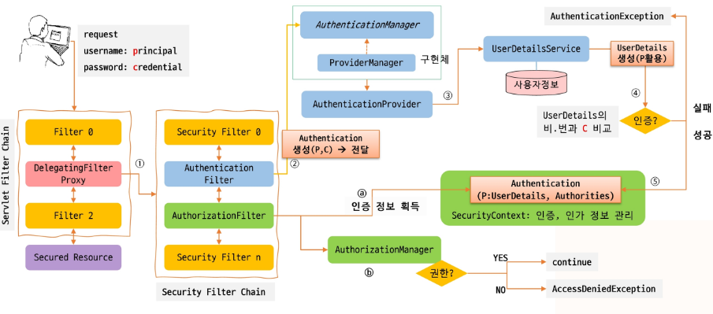

## Spring Security

- Principal이 Secured Resource에 접근할 때, Authentication을 통해 신원을 확인하고 Authorization을 통해 접근 권한을 검등하는 보안 프레임워크
- 컨터에너에 무관하게 적용
    - WAR, EAR 형태로 배포될 수 있으며 standalone 형태로도 실행 가능
    - Servlet Application에서 Filter 기반으로 동작
- 관점 분리
    - `@Transactional` 처럼 보안적인 이슈와 비즈니스 로직 분리(`@Sercured`)

---

### Authentication과 Authorization 절차



---

#### Sercurity Filter Chain

- **DelegatingFilterChainProxy** : Spring에서 제공하는 Filter
    - Servlet 컨테이너의 라이프사이클과 Srping의 WebApplicationContext 사이의 브릿지 역할 수행
    - ApplicationContext에서 선언된 Filter의 목록을 Lazy하게 가져와서 실행
- **FilterChainProxy** : DelegatingFilterProxy로 부터 작업을 위임받은 Filter
    - SercurityFilterChain을 목록으로 관리하며 Security관련 작업을 위임
- **SecurityFilterChain**
    - Security와 관련된 Filter의 chain으로 인증 필터, CSRF 필터, 로그아웃 필터 등 기능 별로 filter들이 연결

| **실행 순서**        | **필터명**              | **주요 역할**                                                                   | **핵심 메커니즘**                                                                    |
| -------------------- | ----------------------- | ------------------------------------------------------------------------------- | ------------------------------------------------------------------------------------ |
| **1**                | **CsrfFilter**          | CSRF 공격 방지                                                                  | 사용자가 보낸 요청에 올바른 **CSRF 토큰**이 포함되어 있는지 검증                     |
| **2**                | **LogoutFilter**        | 로그아웃 처리                                                                   | 로그아웃 URL 요청 시 세션을 무효화하고 **SecurityContext**의 인증 정보 삭제          |
| **3**                | UsernamePassword        |
| AuthenticationFilter | 폼 기반 로그인 인증     | 사용자가 입력한 **ID/PW를 가로채서** `AuthenticationManager`를 통해 로그인 처리 |
| **4**                | RememberMe              |
| AuthenticationFilter | 자동 로그인 처리        | 세션이 만료되었을 때, 사용자의 **Remember-Me 쿠키**를 확인하여 자동 인증        |
| **5**                | **AuthorizationFilter** | 최종 접근 권한 검증                                                             | 인증된 사용자가 해당 요청(URL 등)에 접근할 수 있는 **권한(Role)이 있는지 최종 판단** |

---

#### Authentication

- **AbstractAuthenticationProcessionFilter**
    - 사용자 요청을 가로채서 Authentication 객체 생성
- Authentication은 AuthenticationManger에게 전달돼서 인증처리
- **Authentication**
    - Principal : 사용자 식별하는 정보(username/UserDatils 타입 객체)
    - Credentials : 자격증명으로 Password(또는 토큰, 인증서 등)
    - Authorities : ROLE_ADMIN, ROLE_USER 등 사용자가 부여 받은 권한
    - **인증 전 : 사용자가 인증을 AuthenticationManagerr에게 제공**
        - Principal(username)과 Credentials(password)로 구성
    - **인증 후 : AuthenicationManager가 인증한 사용자의 정보**
        - Principal(UserDetails)과 Authorities로 구성
        - Credentials는 보안을 위한 삭제
    - **SecurityContext**
        - 현재 사용자에 대한 Authentication을 세션에 보관하는 객체로 SercurityContextHolder를 통해 접근
        - ThreadLocal에 저장되어 동일 스레드 내에서 언제든 현재 사용자 정보에 접근 가능
- **AuthenticationManager**
    - 인증을 수행하는 방법을 정의한 인터페이스로 구현체는 ProviderManager
    - ProviderManager : 여러 AuthenticationProvider들에게 인증 처리 위임
        - 순차적으로 인증 요청 → 마지막까지 인증 처리 실패 시 ProviderNotFoundException발생
    - 반환된 인증 정보는 SercurityContextHolder에서 관리됨
        - Session Scope 에서 SPRING_SECURITY_CONTEXT로 등록

---

#### Authorization

- **Authorization**
    - Authentication 객체를 포함된 GrantedAuthority 목록을 사용하여 수행되는 프로세스
        - GrantedAuthority: 사용자에게 부여된 권한으로 특정 작업을 수행할 수 있는지에 대한 정보
    - 권한은 일반적으로 ‘ROLE_’ 접두사로 관리(ROLE_ADMIN, ROLE_USER)
- **AuthorizationManager**
    - GrantedAuthority를 이용해 Secured resource를 호출할 수 있는지에 대한 권한 점검
    - GrantedAuthority를 이용해 Secured resource에서 값은 반환 받을 수 있는지에 대한 결정
    - 선언적으로 처리할 수 경우는 `@PreAuthorize` , `@PostAuthorize` 적용

| **실행 순서**        | **필터명**              | **주요 역할**                                                         | **핵심 메커니즘**                                                           |
| -------------------- | ----------------------- | --------------------------------------------------------------------- | --------------------------------------------------------------------------- |
| **1**                | **LogoutFilter**        | 로그아웃 처리                                                         | 로그아웃 URL 요청 시 세션을 만료시키고 로그인 정보를 지워줌                 |
| **2**                | UsernamePassword        |
| AuthenticationFilter | 폼 기반 로그인 인증     | 사용자가 입력한 **ID와 비밀번호**를 가로채서 실제 로그인(인증)을 처리 |
| **3**                | **AuthorizationFilter** | 최종 접근 권한 검증                                                   | 인증된 사용자가 해당 URL에 접근할 수 있는 **권한(Role)이 있는지 최종 판단** |

---

### Security 설정 메서드 - 필터 매핑 표

| **설정 메서드**               | **용도**                                                                    | **관련 필터**           | **필터의 실제 역할**                                                         |
| ----------------------------- | --------------------------------------------------------------------------- | ----------------------- | ---------------------------------------------------------------------------- |
| **`authorizeHttpRequests()`** | URL별 권한 설정                                                             | **AuthorizationFilter** | 이 주소는 로그인해야 하는지, 관리자만 들어가는지 최종 권한 검증 및 접근 제어 |
| **`formLogin()`**             | 폼 로그인 설정                                                              | UsernamePassword        |
| AuthenticationFilter          | 사용자가 입력한 ID/PW 기반의 `POST /login` 요청을 처리하고 로그인 인증 수행 |
| **`logout()`**                | 로그아웃 설정                                                               | **LogoutFilter**        | 로그아웃 요청을 처리하고 세션 만료, 쿠키 삭제 등의 작업 수행                 |
| **`rememberMe()`**            | 자동 로그인 설정                                                            | RememberMe              |
| AuthenticationFilter          | 브라우저에 남은 Remember-me 쿠키를 검증하여 자동으로 세션/인증 재생성       |
| **`csrf()`**                  | CSRF 보호 설정                                                              | **CsrfFilter**          | 데이터 변경 요청(POST, PUT 등) 시 CSRF 토큰이 일치하는지 검증                |

### Authorization 필터 설정

- **특정 경로 권한 설정**

```java
authorize.requestMatchers("/secured/user/**").hasRole("USER")
//                         ↑ 대상 경로          ↑ 필요 조건
```

- **특정 경로 권한 설정**