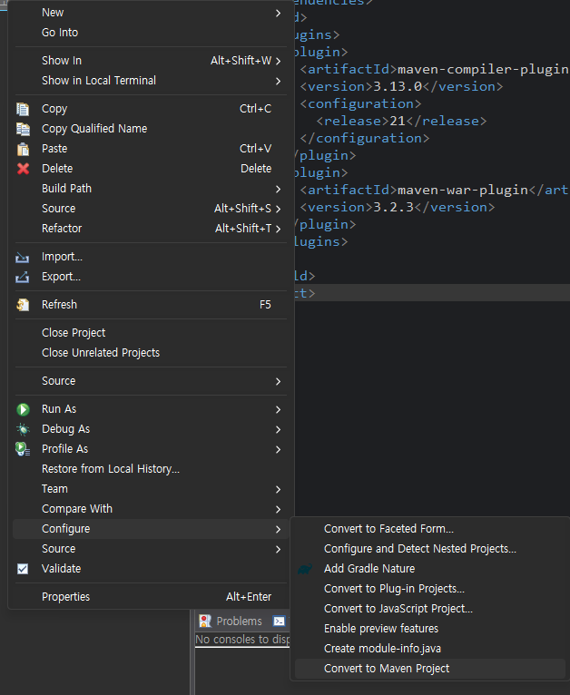
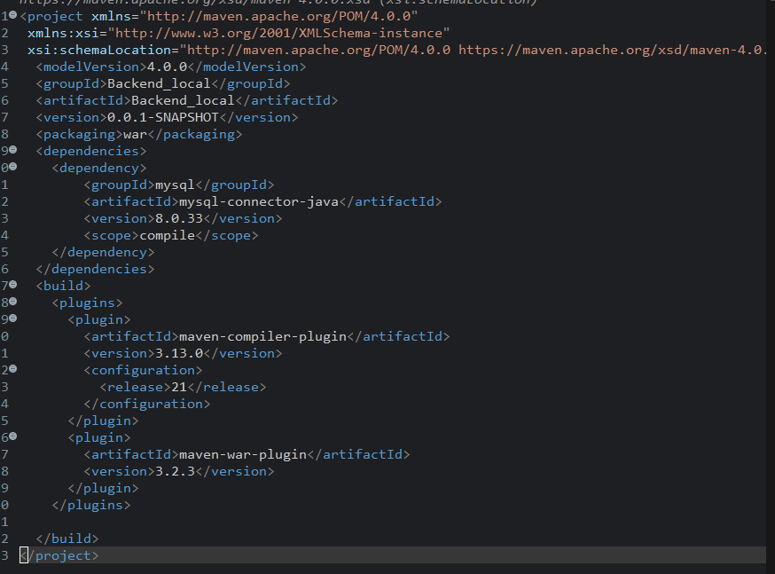
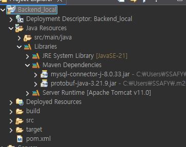

## MAVEN

### 1. 핵심 기능

- **의존성 관리** : 과거에는 필요한 라이브러리(`.jar`파일)를 직접 다운로드 해 프로젝트를 추가했지만, Maven은  `pox.xml` 파일에 필요한 라이브버리 이름과 버전 적어주면 자동으로 다운로드
- **표준화된 프로젝트 구조** : 모든 Maven 프로젝트는 동일한 폴더 구조를 가짐
    
    (소스 코드는  `src/main/java` , 설정 파일은 `src/main/resources` )
    
    ```jsx
    src/
     ├── main/java
     ├── main/resources
     └── test/java
    ```
    
- **빌드 생명 주기 :** 컴파일, 테스트 패키징(WAR/JAR 생성), 배포 등 빌드 과정을 단계별 자동화

---

### 2. pom.xml(Project Object Model)

- **프로젝트 정보** : 프로젝트 이름, 버전
- **의존성(Dependencies)** : 프로젝트에서 사용하는 외부 라이브러리 목록
- **플러드인(Plugins**) : 빌드 시 실행할 추가 작업 설정

---

### 3. Maven의 작동 원리

- **Local Repository** : 개발자의 PC에 있는 저장소, 한 번 다운로드 한 라이브러리 저장되어 재사용
- **Central Repository** : 오픈소스 라이브러리들이 모여 있는 원격 저장소, 필요한 라이브러리가 로컬에 없으면 여기서 가쟈옴
- **Remote Repository** : 기업 내부 나 특정 단체에세 운영하는 별도의 저장소

---

### 4. 사용 이유

- **협업의 용이성** : 팀원과 동일한 라이브러리 버전을 사용하도록 할 수 있음
- **자동화** : 명령 하나로 복잡한 빌드와 테스트 과정 끝낼 수 있음
- 라이브러리 전파 : 특정 라이브러리가 다른 라이브러리 필요할 때 Maven에서 연관된 것을 가져

<br><br>

## JAVA 프로젝트 → Maven 프로젝트

### 방법

#### 1. 경로
```
프로젝트 우클릭 → Configure → Convert to Maven Project
```



---

#### 2. 설정 창 나오면

보통 이렇게 입력

- **Group Id**: 회사/프로젝트 그룹
예: `com.example`
- **Artifact Id**: 프로젝트 이름
자동으로 채워짐
- **Version**: 기본값 사용 (`1.0-SNAPSHOT`)


---

### 3. 완료되면 변화

`pom.xml` 생성됨

 `Maven Dependencies` 생김

 프로젝트가 Maven 관리로 바뀜

---

### 이후 꼭 해야할 것

### 4. Maven 동기화

```
프로젝트 우클릭 → Maven → Update Project
```

<br><br>

## Maven Repository 사용

**Maven Repository는 라이브러리 저장소**

---

### 1. 대표 사이트

**Maven Central Repository(**https://mvnrepository.com/**)**

- Spring
- Lombok
- Gson
- JUnit

같은 라이브러리 검색 가능

---

### 2. 사용 방법

#### 1. 사이트에서 라이브러리 검색

예 : Mysql

#### 2. dependency 복사

```jsx
<dependency>
	    <groupId>mysql</groupId>
	    <artifactId>mysql-connector-java</artifactId>
	    <version>8.0.33</version>
	    <scope>compile</scope>
	</dependency>
```

#### 3. pom.xml에 붙여넣기

Maven이 자동 다운로드



**→ Maven 의존성 목록에 라이브러리 설치된 것을 확인할 수 있음**



---

### 3. 내부 동작 구조

#### 전체 흐름

```jsx
1. dependency 요청 발생
2. Local Repository(.m2) 먼저 확인
3. 없으면 Remote Repository 확인
4. 그래도 없으면 Central Repository 접근
5. 다운로드 후 Local에 저장
6. 이후에는 Local에서만 사용
```

#### 1. Local Repository(내 컴퓨터)

**위치**

```jsx
~/.m2/repository
```

**역할**

- 캐시 저장소
- 이미 다운로드한 라이브러리 저장

#### 2. Remote Repository(회사/팀)

**회사에서 쓰는 서버**

**역할**

- 사내 라이브러리 관리
- 외부 다운로드 제한 시 사용

#### 3. Central Repository(공식 저장소)

**Maven Central Repository(**https://mvnrepository.com/**)**

**역할**

- 전 세계 라이브러리 저장소