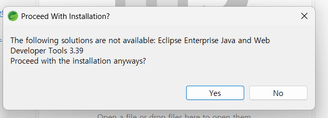
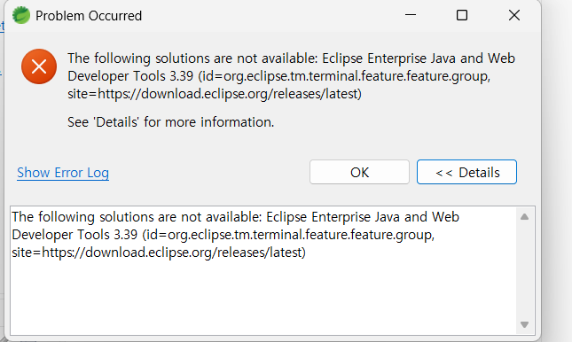

## STS 와 Enterprise 버전 불일치



```java
The following solutions are not available:
Eclipse Enterprise Java and Web Developer Tools 3.39
```

- 설치하려는 웹 개발 도구와 STS 버전이 안맞음
- 또는 업데이트 사이트가 깨짐 / deprecated됨

---

### 발생 원인



```java
org.eclipse.tm.terminal.feature.feature.group
```

**Enterprise Java and Web Developer Tools를 설치하려고 했는데, 거기에 필요한 Terminal 관련 의존성을 지금 STS가 못 가져오고 있음**

보통 원인은 셋 중 하나

1. **STS 버전이 안맞음**
2. **현재 등록된 update site가 꼬였음**
3. **네트워크/학교망 때문에 일부 저장소 접근 막힘**

**STS에 플러그인만 추가해서 해결하려면 계속 꼬일 가능성 높다**

<br><br>

## 해결 방법

### 1. STS 업데이트

```java
Help → Check for Updates
```

업데이트 가능한 거 전부하고 재시작

다음으로 다시 Marketplace에서 설치 시도

---

### 2. update site 정리

```java
Window → Preferences → Install/Update → Available Software Sites
```

들어갔을 경우

- https://download.eclipse.org/releases/latest
- STS 관련 update

여기서

- 깨진 사이트
- 오래된 사이트
- 중복 사이트

가 있다면 체크 해제하거나 정리

특히 `download.eclipse.org` 쪽이 disabled 되어 있으면 설치가 잘 안될 수 있다

---

### 3. Marketplace 말고 필요한 기능만 직접 설치 시도

`Help → Install New Software`

Work with 에 아래 넣기:

```
https://download.eclipse.org/releases/latest
```

잠깐 기다린 다음 검색창에:

```
Web
```

또는

```
WTP
```

찾아서

- Web Developer Tools
- JST Server Adapters
- JST Server Adapters Extensions

같은 웹 관련 것만 설치
전체 Enterprise Java and Web Developer Tools를 한 번에 넣으려다 의존성 때문에 터지는 경우가 많아서, **웹 기능만 쪼개서 설치**하는 게 더 잘 될 때 있다.

<br><br>

## 결론
#### STS에서는 Enterprise Java and Web Developer Tools 설치가 버전/의존성 문제로 실패하는 경우가 많으며, Eclipse EE버전을 사용하는 것이 가장 안정적인 해결방법이다.
