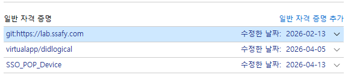

## GitHub 자격 증명(Credential) 

### 문제 상황
- 컴퓨터에 저장된 깃허브 로그인 정보와 올리려는 저장소의 주인이 다를 경우
- 공용 PC 사용
- 계정 전환 실패(여러 계정을 사용하는데 , 윈도우 자격 증명에 다른 계정이 있어 업데이트가 안됨)
  
```
C:\Users\SSAFY\InSSAFY>git push origin main
remote: Permission to yonheeee/InSSAFY.git denied to basisp.
fatal: unable to access 'https://github.com/yonheeee/InSSAFY/': The requested URL returned error: 403
```
  
---

#### **1. 헤결 방법**

1. **제어판 확인**

```
제어판 → 사용자 계정 → 자격 증명 관리자 → Window 자격 증명 
```
---

2. **목록에서 url 찾기** <br>

해당하는 url 항목을 찾아 **제거**

---

3. 다시 git push를 하면 로그인 창이 뜰 때 **본인의 ID와 PAT(토큰)** 입력

<br><br>

#### **2. 헤결 방법**
원격주소에 내 정보 강제로 넣기

```
git remote set-url origin https://github.com/사용자이름/레포이름.git
```
이렇게 하면 푸시할 때 토큰을 물어봄

<br><br>

#### **3. 헤결 방법**
만약 본인이 전의 계정을 계속 써야한다면
```
GitHub 저장소의 Settings > Collaborators → 계정을 초대(Invite)
```
